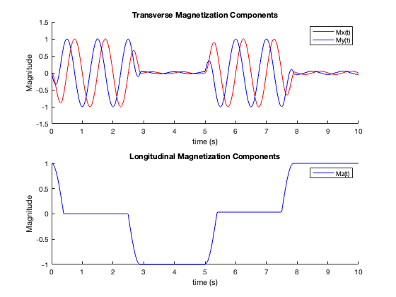

# 3D Bloch Simulator Educational Tool for MRI
This code is intended to be used as an educational tool for understanding magnetic resonance imaging. It allows you to play with and visualize the precession behavior of the net magnetization vector of atomic nuclei which is the origin of the signal in NMR and MRI. MRI can be entirely understood from the classical behavior of a magnetic vector, $\vec{M}$ rotating in 3D space under the influence of an external magnetic field $\vec{B_0}$, much like that of a gyroscope rotating in the presence of a graviational field. This simulator can help you visualize and get an intuition for precession, relaxation, and the effect that radio frequency pulses, $\vec{B_1}$, have on the magnetic vector.

The primary file is ```precession.m``` which contains the user controlled simulation parameters at the top, instantiation of the Matlab ODE solver function, and 3D plotting of the magnetization vector (see Examples Below) and aloing with its vector components. 

# Examples

### Free Precession, no relaxation, viewed in laboratory (non-rotating) reference frame.
https://github.com/user-attachments/assets/a839607b-cd58-42c9-923c-1dfd77fbe553

### Free Precession, no relaxation, viewed in rotating reference frame.
https://github.com/user-attachments/assets/9efabe22-052f-4dd2-bb38-708cc329a4f7

### Free Precession, with relaxation, laboratory frame
https://github.com/user-attachments/assets/8807b76e-a9e2-4fda-ae8d-a3e8c8a0f3af

### Free Precession, with relaxation, rotating frame
https://github.com/user-attachments/assets/3b4f048d-bd7f-4f31-9b7d-1c4b510fac84

### Forced Precession (applied $\vec{B_1}$), no relaxation, laboratory frame
https://github.com/user-attachments/assets/01184d66-f574-4a84-a72a-3608839ca9ec

### Forced Precession, no relaxation, rotating frame
https://github.com/user-attachments/assets/48d8e88e-42a5-4262-b9fa-e1786f7ae7e7

### Magnetization components ($x,y,z$) versus time, four $\frac{\pi}{2}$ pulses


User's can control parameters such as:
- T1 & T2.
- Number of $\vec{B_1}$ excitations.
- $\vec{B_1}$ Magnitude.
- Flip Angle.
- Whether to view the bulk magnetization vector in the rotating or laboratory frame.
- Whether to simulate relaxation or not.
- Whether to trace the tip of the magnetization vector as it moves in 3D space.
- And more!

# Dependencies
- [arrow3d](https://www.mathworks.com/matlabcentral/fileexchange/71994-arrow-3d) on Matlab File exchange to draw the spin vector in 3D space.

# References
This code also makes use of some some code (```showspins.m```) from the [RAD229](https://web.stanford.edu/class/rad229/index.html) course at Stanford taught by Brian Hargreaves and Daniel Ennis.

